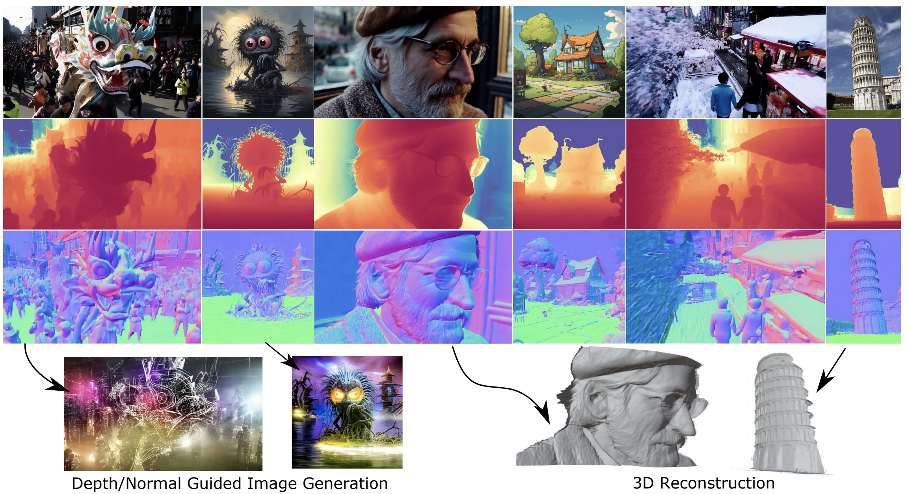

# GeoWizard: Unleashing the Diffusion Priors for 3D Geometry Estimation from a Single Image
### [Project Page](https://fuxiao0719.github.io/projects/geowizard/) | [Paper](https://arxiv.org/abs/2403.12013) | [Hugging Face](https://huggingface.co/spaces/lemonaddie/geowizard)
<br/>

> GeoWizard: Unleashing the Diffusion Priors for 3D Geometry Estimation from a Single Image
                                                                 
> [Xiao Fu*](http://fuxiao0719.github.io/), [Wei Yin*](https://yvanyin.net/), [Mu Hu*](https://github.com/JUGGHM), [Kaixuan Wang](https://wang-kx.github.io/), [Yuexin Ma](https://yuexinma.me/), [Ping Tan](https://ece.hkust.edu.hk/pingtan), [Shaojie Shen](https://uav.hkust.edu.hk/group/), [Dahua Lin†](http://dahua.site/) , [Xiaoxiao Long†](https://www.xxlong.site/)
> * Equal contribution; † Corresponding authors                    
> Arxiv Preprint, 2024



## 🛠️ Setup

We test our codes under the following environment: `Ubuntu 22.04, Python 3.9.18, CUDA 11.8`.
1. Clone this repository.
```bash
git clone git@github.com:fuxiao0719/GeoWizard.git
cd GeoWizard
```
2. Install packages
```bash
conda create -n geowizard python=3.9
conda activate geowizard
pip install -r requirements.txt
cd geowizard
```

## 🤖 Usage

### Run inference for depth & normal

Place your images in a directory `input/example` (for example, where we have prepared several cases), and run the following inference. The depth and normal outputs will be stored in `output/example`.

```bash
python run_infer.py \
    --input_dir ${input path} \
    --output_dir ${output path} \
    --ensemble_size ${ensemble size} \
    --denoise_steps ${denoising steps} \
    --domain ${data type}
# e.g.
python run_infer.py \
    --input_dir input/example \
    --output_dir output \
    --ensemble_size 3 \
    --denoise_steps 10 \
    --domain "indoor"
```

Inference settings: `--domain`: Data type. Options: "indoor", "outdoor", and "object". Note that "object" is best for background-free objects, like that in objaverse. We find that "indoor" will suit in most scenarios. Default: "indoor". `--ensemble_size` and `--denoise_steps`: trade-off arguments for speed and performance, more ensembles and denoising steps to get higher accuracy. Default: 3 and 10. 

## 📝 TODO List
- [ ] Add inference code for 3D reconstruction.
- [ ] Add training codes.
- [ ] Test on more different local environments.

## 📚 Related Work
We also encourage readers to follow these concurrent exciting works.
- [Marigold](https://arxiv.org/abs/2312.02145): a finetuned diffusion model for estimating monocular depth.
- [Wonder3D](https://arxiv.org/abs/2310.15008): generate multi-view normal maps and color images and reconstruct high-fidelity textured mesh.
- [HyperHuman](https://arxiv.org/abs/2310.08579): a latent structural diffusion and a structure-guided refiner for high-resolution human generation.
- [GenPercept](https://arxiv.org/abs/2403.0609): a finetuned UNet for a lot of downstream image understanding tasks.
- [Metric3D](https://github.com/YvanYin/Metric3D): a discriminative metric depth and surface normal estimator.

## 🔗 Citation

```bibtex
@article{fu2024geowizard,
  title={GeoWizard: Unleashing the Diffusion Priors for 3D Geometry Estimation from a Single Image},
  author={Fu, Xiao and Yin, Wei and Hu, Mu and Wang, Kaixuan and Ma, Yuexin and Tan, Ping and Shen, Shaojie and Lin, Dahua and Long, Xiaoxiao},
  journal={arXiv preprint arXiv:2403.12013},
  year={2024}
}
```
